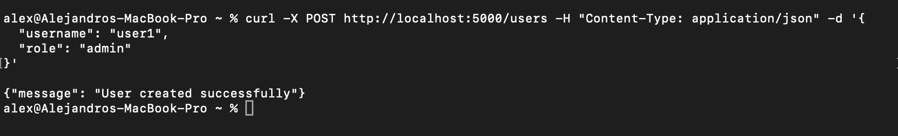
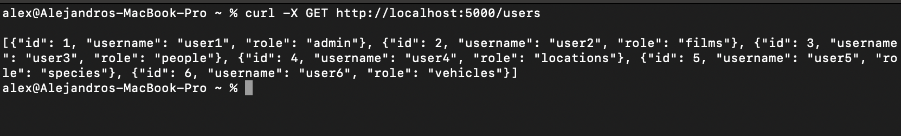
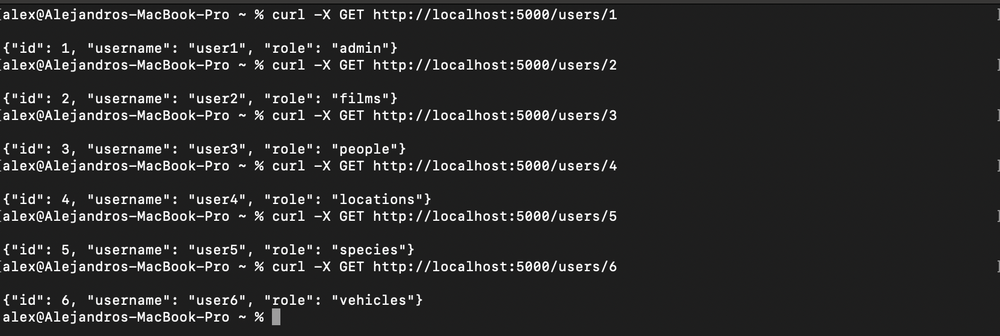
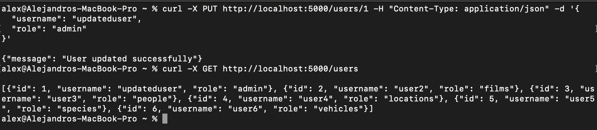
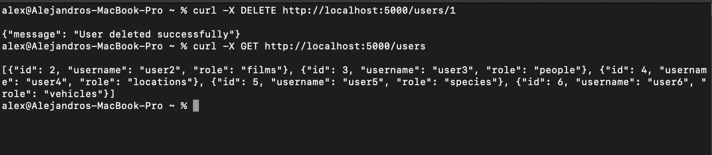
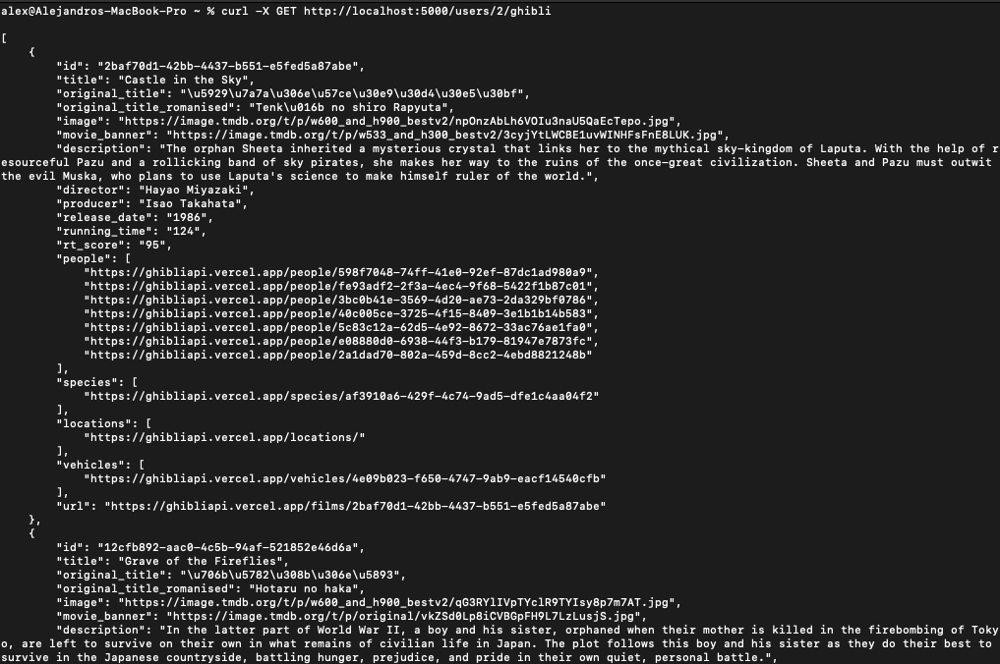

# BanpayChallenge

# Prerequisites
- Docker installed in your machine.
- Git installed in your machine.

# Installation
**Clone this repository**

    git clone https://github.com/AlexZetroc/BanpayChalenge.git

## Docker Setup

    run the next command:
    docker-compose up

## Endpoints

- **Create User**: `POST /users`
- **Get All Users**: `GET /users`
- **Get Specific User**: `GET /users/<int:user_id>`
- **Update User**: `PUT /users/<int:user_id>`
- **Delete User**: `DELETE /users/<int:user_id>`
- **Get Ghibli Data for User**: `GET /users/<int:user_id>/ghibli`

### Example `curl` Commands

- **Create User**

    ```sh
    curl -X POST http://localhost:5000/users -H "Content-Type: application/json" -d '{
      "username": "testuser",
      "role": "films"
    }'
    ```
- Example creating admin
  


- **Get All Users**

    ```sh
    curl -X GET http://localhost:5000/users
    ```
  
- Example getting users
  

- **Get Specific User**

    ```sh
    curl -X GET http://localhost:5000/users/1
    ```
  
- Example getting specific user
  

- **Update User**

    ```sh
    curl -X PUT http://localhost:5000/users/1 -H "Content-Type: application/json" -d '{
      "username": "updateduser",
      "role": "people"
    }'
    ```
  
- Example updating user
  

- **Delete User**

    ```sh
    curl -X DELETE http://localhost:5000/users/1
    ```
  
- Example deleting user
  

- **Get Studio Ghibli Data for User**

    ```sh
    curl -X GET http://localhost:5000/users/1/ghibli
    ```

- Example calling api using GET method on studio ghibli
  

## Running tests

**To run the tests just use the next command**

  ```sh
  docker-compose run test
  ```
